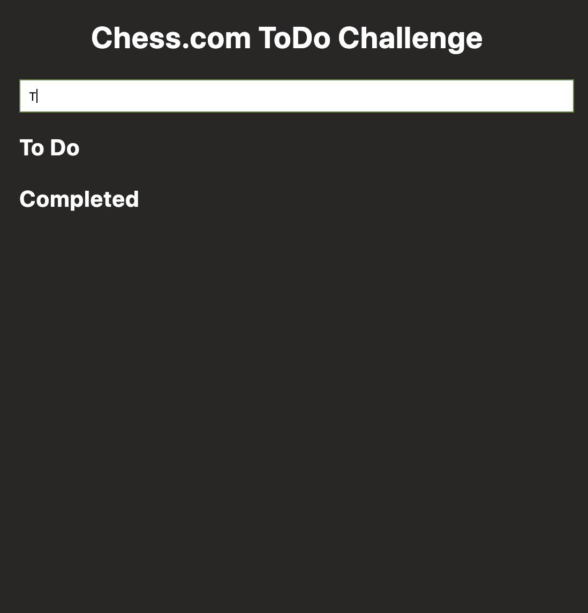

# Chess.Com Frontend ToDo Challenge

### Installation

```
npm install
```

### Start Dev Server

```
npm run dev
```

---

## Requirements

Make a simple todo application that can add todo items and complete them.

- When the "enter" key is pressed in the input, add an item to the "To Do" list
  - Do not add empty items
- When an item in the "To Do" list is clicked, it should be removed and added to the "Completed" list
- When an item in the "Completed" list is clicked, it should be removed and added to the "To Do" list
- Don't worry about styling. Focus on JS.
- You may not use any frameworks.

---


